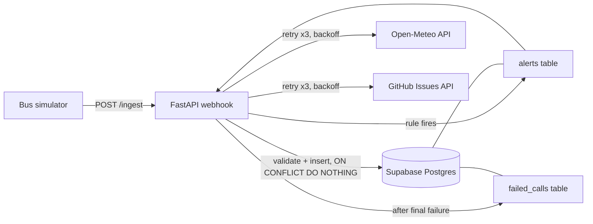

# EV Fleet Event Pipeline

A webhook-driven pipeline that connects four systems: simulated EV bus telemetry, a FastAPI service, a Postgres database (Supabase), and two external APIs (Open-Meteo and GitHub). A bad battery reading becomes a stored alert, an enriched record, and an open work order, with no manual steps.

I built this as a portfolio project modeled on a problem I know from working with electric bus fleets: telematics data is messy, duplicated and late, and the systems around it fail. The data is simulated. No company data is used.

## What it does

1. A Python simulator posts JSON readings (state of charge, battery temperature, odometer, GPS) for several buses to a webhook.
2. The webhook validates each reading and stores it in Postgres. Duplicate events are ignored.
3. A rule checks each new reading. If battery temperature is above 45 C, an alert is created, linked to the exact reading that caused it.
4. The alert is enriched with the ambient temperature at the bus's location from Open-Meteo, so the team can tell a hot day from a real thermal fault.
5. A GitHub Issue is opened automatically as the work order, and its link is saved on the alert.
6. If either external call fails, it is retried with backoff and, if it still fails, logged to a `failed_calls` table. The alert itself is never lost.

## Architecture



## Systems connected

| Role | Tool |
|---|---|
| Event source | Python simulator |
| Webhook receiver | FastAPI |
| Database | Supabase (Postgres) |
| Enrichment API | Open-Meteo (free, no key) |
| Work-order system | GitHub Issues API |

## Design decisions

**Idempotent ingestion.** Each reading carries an `event_id`, which is the primary key of `telemetry`. The insert uses `ON CONFLICT DO NOTHING`, so a retried or duplicated webhook is stored once. The `event_id` identifies the real-world reading, not the delivery attempt, so a sender can safely retry after a timeout.

**Validation at the edge.** Pydantic rejects impossible values (for example state of charge above 100) with a 422 before anything reaches the database.

**The alert is committed before enrichment.** The telemetry insert and the alert insert happen in one transaction. Weather and work-order calls happen afterwards, so a slow or failing third-party API cannot block or lose a safety alert.

**No invented data.** If the weather call fails, `ambient_temp_c` stays NULL, meaning "unknown". It is never filled with a stand-in value.

**Retries with exponential backoff.** External calls are tried up to three times, waiting 1 second and then 2 seconds between attempts. Each call has a timeout, so a hung API cannot hang the endpoint.

**Failures are recorded, not swallowed.** After the final attempt, the failure goes to `failed_calls` with the step, error, attempt count and a `resolved` flag, so a later job can retry unresolved items.

**Alert uniqueness.** `UNIQUE (event_id, rule)` on `alerts` means one reading cannot raise the same alert twice.

**Secrets stay out of the repo.** Credentials live in a `.env` file excluded by `.gitignore`. The GitHub token is a fine-grained token limited to one repository and the Issues permission, with an expiry. Row Level Security is enabled on all tables.

## Database schema

```sql
create table telemetry (
  event_id uuid primary key,
  bus_id text not null,
  ts timestamptz not null,
  soc numeric,
  battery_temp_c numeric,
  odometer_km numeric,
  lat numeric,
  lon numeric,
  received_at timestamptz default now()
);

create table alerts (
  alert_id bigint generated always as identity primary key,
  event_id uuid not null references telemetry(event_id),
  bus_id text not null,
  rule text not null,
  value numeric,
  status text not null default 'open',
  created_at timestamptz not null default now(),
  ambient_temp_c numeric,
  issue_url text,
  unique (event_id, rule)
);

create table failed_calls (
  id bigint generated always as identity primary key,
  event_id uuid not null,
  step text not null,
  error text,
  attempts int not null,
  resolved boolean not null default false,
  created_at timestamptz not null default now()
);
```

`ts` is when the bus took the reading and `received_at` is when the server got it. Keeping both makes lag and out-of-order delivery visible.

## Run it locally

1. Create the three tables above in a free Supabase project.
2. Create a `.env` file in the project folder:

```
DATABASE_URL=your-supabase-session-pooler-connection-string
GITHUB_TOKEN=your-fine-grained-token
GITHUB_REPO=your-username/your-repo
```

3. Install and start the server:

```bash
pip install fastapi uvicorn pydantic "psycopg[binary]" python-dotenv requests
uvicorn main:app --reload
```

4. In another terminal, send readings:

```bash
python simulator.py              # normal readings from 3 buses
python simulator.py temp_spike   # BUS-02 reports 58 C in its third round
```

The interactive API docs are at `http://127.0.0.1:8000/docs`, and `GET /health` returns `{"status": "ok"}`.

## What I tested

- Valid and invalid payloads (422 on bad data)
- The same event sent twice: stored once, then reported as `duplicate`
- A reading over the threshold: alert created, ambient temperature added, GitHub Issue opened
- Weather API deliberately broken: alert and issue still created, `ambient_temp_c` left NULL, three retries logged, one row in `failed_calls`

## Known limitations and next steps

- The rule engine has one rule (high battery temperature). Odometer regression, fast SOC drop and silent-bus detection are the next rules.
- Failed calls are recorded but not yet retried automatically by a background job.
- The endpoint has no API-key header yet, and there is no rate limiting.
- Closing an issue does not yet update the alert status. A GitHub webhook back into the API would close that loop.
- At much higher volume I would put a queue between the webhook and processing, partition or aggregate raw telemetry, and move analytics to a warehouse such as BigQuery.
